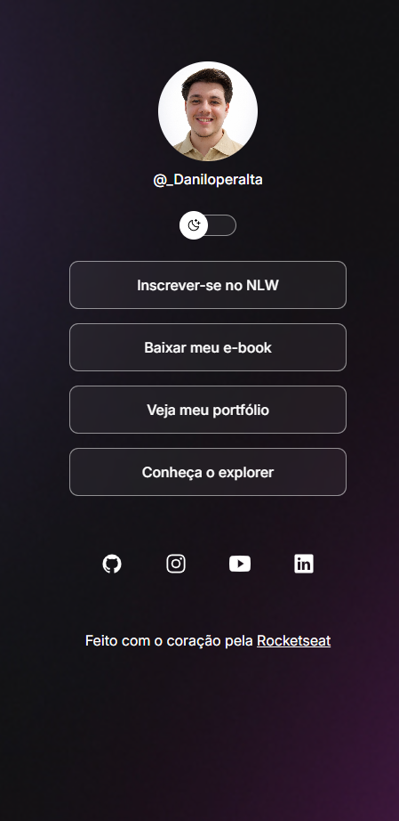

# 🚀 Projeto

Este é um projeto desenvolvido para praticar HTML, CSS e JavaScript, com foco em layout responsivo, alternância de tema (light/dark) e organização de código.

---

## 📸 Preview

> Se quiser, você pode tirar um print do projeto e salvar como `preview.png` dentro da pasta `assets`.

---

## 🛠️ Tecnologias utilizadas

- HTML5
- CSS3
- JavaScript
- Git & GitHub

---

## 🎨 Funcionalidades

- ✅ Layout responsivo
- ✅ Alternância entre modo Light e Dark
- ✅ Estilização com variáveis CSS
- ✅ Efeito de hover interativo
- ✅ Organização moderna de código

---

## 📂 Estrutura do projeto

